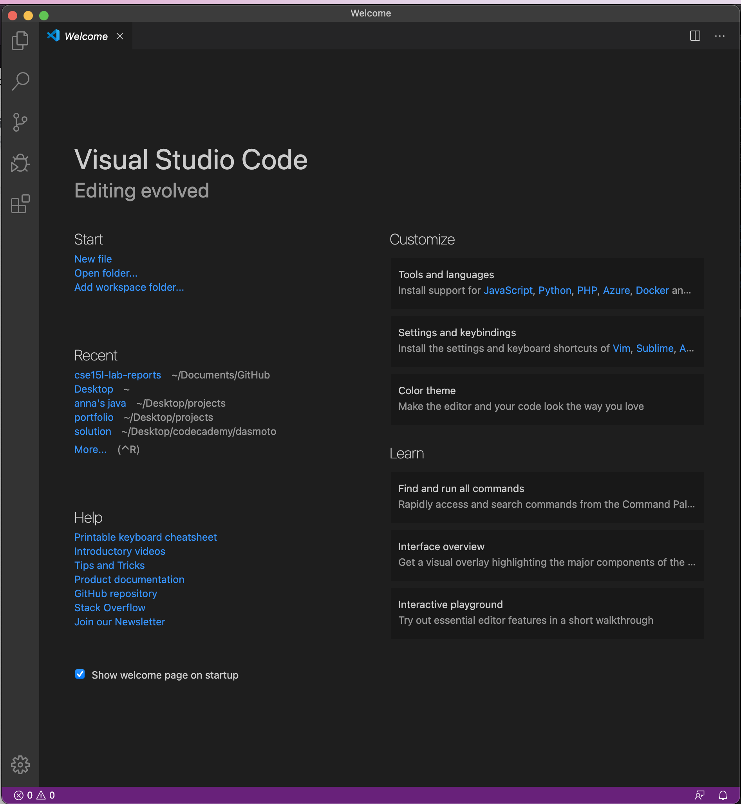
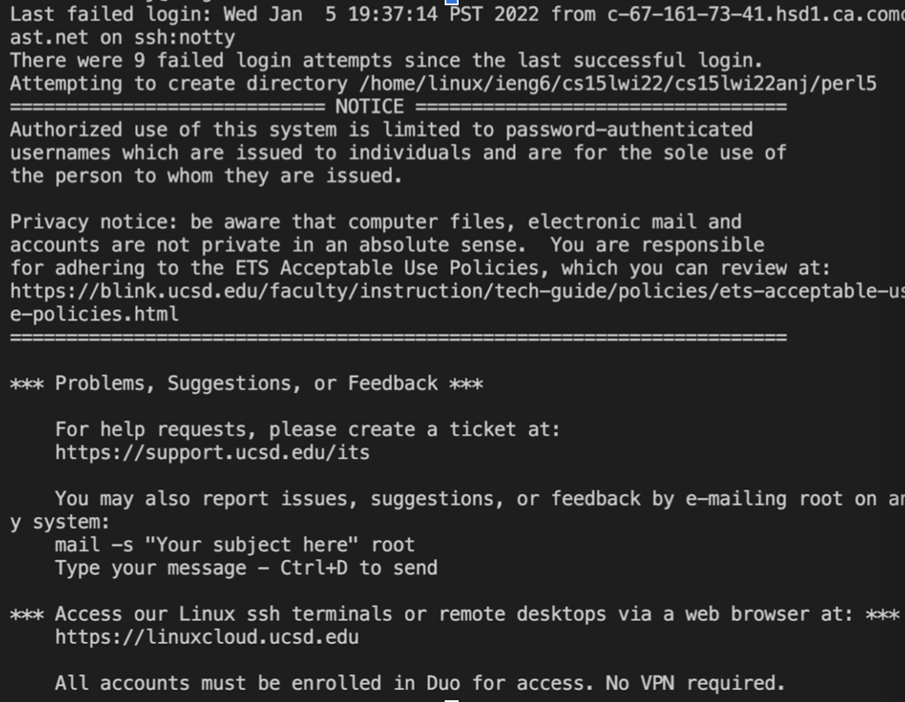
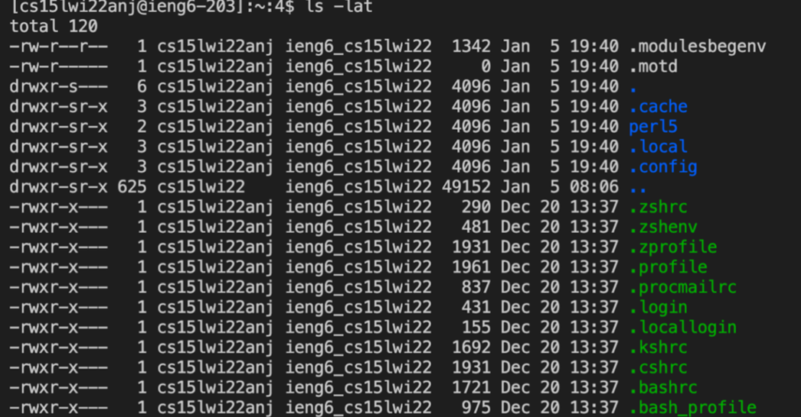
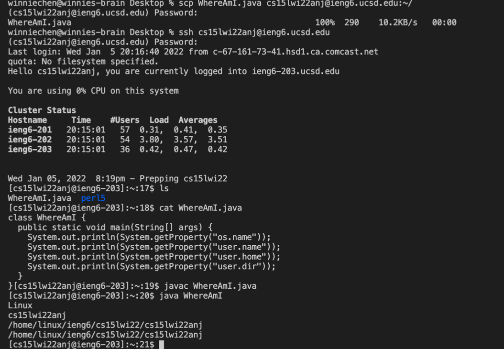
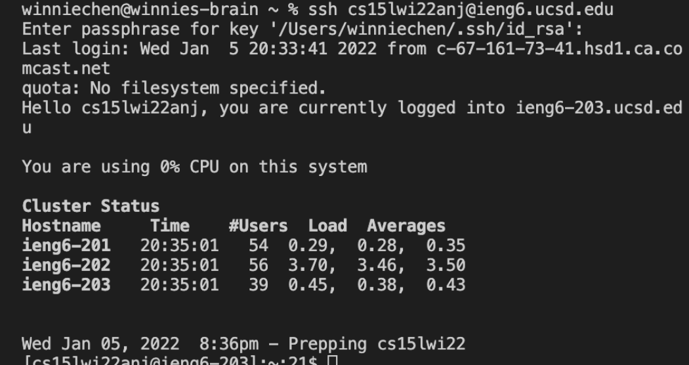
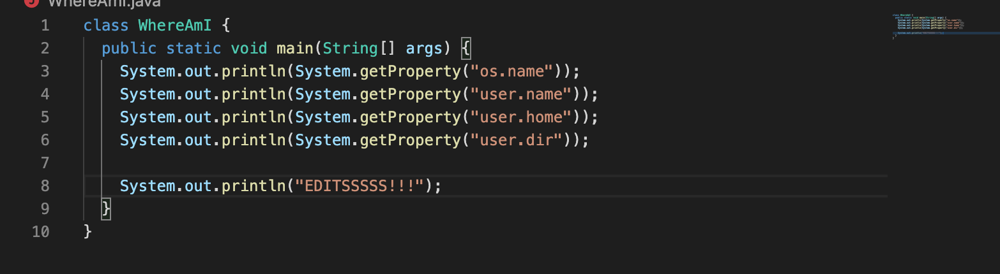
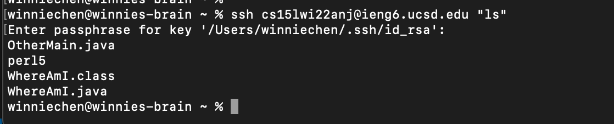

# Lab Report 1

## Installing VScode
1. Go to the [Visual Studio Code](https://code.visualstudio.com/) website to download and install VScode onto your computer.
2. Once you successfully install VScode, it should look like this when you open it (the colors and theme may vary depending on your computer settings):


## Remotely Connecting
1. Go to [this link](https://sdacs.ucsd.edu/~icc/index.php) and look up your course specific account (for CSE 15L). You will have to change your password to activate your account.
2. Open a terminal in VSCode (```command/ctrl + ``` , or use menu option Terminal -> New Terminal). 

3. Type in the command (zz replaced by your account's specific letters):
```
ssh cs15lwi22zz@ieng6.ucsd.edu
```
4. If you are asked if you are sure you want to continue connecting (will happen if it's your first time connecting to this server),  enter the command ```"yes"```.
5. Since it's your first time logging into your account, it will print out these messages:


## Trying Some Commands
Here are some commands you can try:
```
cd ~
cd
ls -lat
```

```
ls -a
ls 'directory' 
```
where 'directory' is /home/linux/ieng6/cs15lwi22/cs15lwi22abc, where the abc is one of the other group members’ username
```
cp /home/linux/ieng6/cs15lwi22/public/hello.txt ~/
cat /home/linux/ieng6/cs15lwi22/public/hello.txt
pwd
```
2. To log out of the remote server in your terminal, use Ctrl + D, or run the command ```"exit"```.

## Moving Files with scp
1. To copy files from your computer to a remote computer, you can run the command 
```scp``` We will be running it from the client (your computer, not ieng6).
2. Create a file called ```'WhereAmI.java'``` on your computer with these contents:
```
class WhereAmI {
  public static void main(String[] args) {
    System.out.println(System.getProperty("os.name"));
    System.out.println(System.getProperty("user.name"));
    System.out.println(System.getProperty("user.home"));
    System.out.println(System.getProperty("user.dir"));
  }
}
```
3. Run the command:
```
scp WhereAmI.java cs15lwi22zz@ieng6.ucsd.edu:~/
```
4. You will be prompted to enter your password for the account. (Enter it)
5. When you log into ieng6 again, the file will be there.
6. Extra: Running the program ```'WhereAmI.java'``` (```javac``` + ```java```) from client (your computer) will give you different results from running it when logged into ieng6 because you are using different servers:


## Setting an SSH Key
1. Setting up an SSH key will make it faster to log in because you can set a passphrase instead of typing in your entire password. 
2. To do so, we will utilize ```ssh-keygen```, a program that creates a pair of files called the public key and private key. The ```ssh``` command can use this pair of files instead of your password.
3. On your computer, run the command ```"ssh-keygen"```
4. When prompted for the file in which to save the key, copy and paste the text in the parentheses.
5. Then you will be asked to set and confirm your passphrase.
6. Now login to the account you want to ssh into  and run these commands:
```
$ ssh cs15lwi22zz@ieng6.ucsd.edu
<Enter Password>
# now on server
$ mkdir .ssh
$ <logout>
# back on client
$ scp /Users/joe/.ssh/id_rsa.pub cs15lwi22@ieng6.ucsd.edu:~/.ssh/authorized_keys
# You use your username and the path you saw in the command above
```

Now, when you log in, you will only be asked for the passphrase:


## Optimizing Remote Running
Making a local edit to WhereAmI.java, then copying it to the remote server and running it:
1. Open ```WhereAmI.java``` and make an edit and save.

2. Run
```
cp WhereAmI.java OtherMain.java; javac OtherMain.java; java WhereAmI
```

Ways for you to simplify the process of using the terminal:
1. You can use semicolons to run multiple commands on the same line.
2. To check, you can use the command 
```
ssh cs15lwi22@ieng6.ucsd.edu "ls"
```
to list the home directory on the remote server

3. You can use the up-down arrow eys to recall previous commands


### Here are the steps to run the ls command remotely:

1. Use ```up arrow key``` to get to the previous ssh login command (1 keystroke)


2. Type in ```"ls"``` in quotes at the end of the ssh command (6 keystrokes) and press ```enter``` (1 keystroke).


3. Type in passphrase and ```enter``` (5 keystrokes)


*TOTAL KEYSTROKES* = 1 + 6 + 1 + 5 = **13 KEYSTROKES**