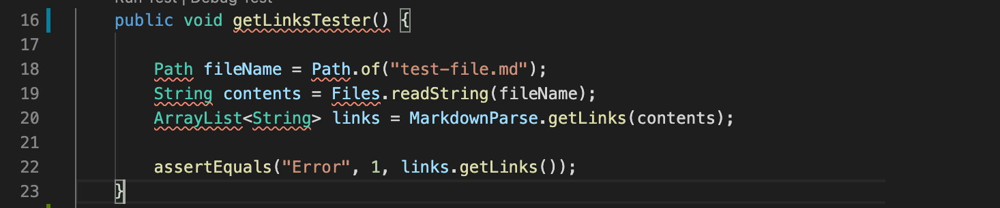
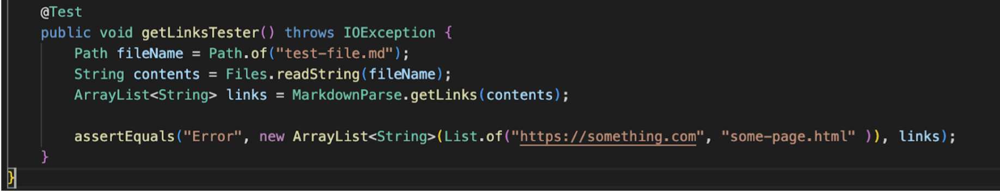
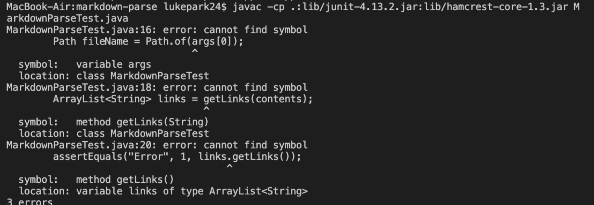

For each of the three code changes:

Show a screenshot of the code change diff from Github (a page like this)
Link to the test file for a failure-inducing input that prompted you to make that change
Show the symptom of that failure-inducing input by showing the output of running the file at the command line for the version where it was failing (this should also be in the commit message history)
Write 2-3 sentences describing the relationship between the bug, the symptom, and the failure-inducing input.

# Lab Report 2

How do I get the change diff from GitHub when it was done on screenshare with VScode? 

Original:

Change:


## Code Change 1
We added ```MarkdownParse.``` in front of ```getLinks()``` because getLinks was not a part of the test file. We had to reference it back to the Markdown file.

## Code Change 2
We added ```throws IOException``` to the end of ```getLinksTester()```. This will let us know if we have an input or output operation that failed.

## Code Change 3
In that same code, we also changed the values passed into ```assertEquals()``` since we were not getting the output correctly.
1. Instead of calling ```getLinks()``` on links, we referenced links directly.
2. Instead of passing in 1, we passed in ```new ArrayList<String>(List.of("https://something.com", "some-page.html"))```.

In the end, we were unable to fix all the bugs to get the test running smoothly.

Compiling errors:
