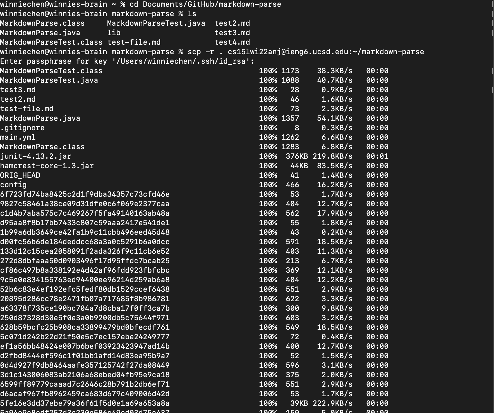
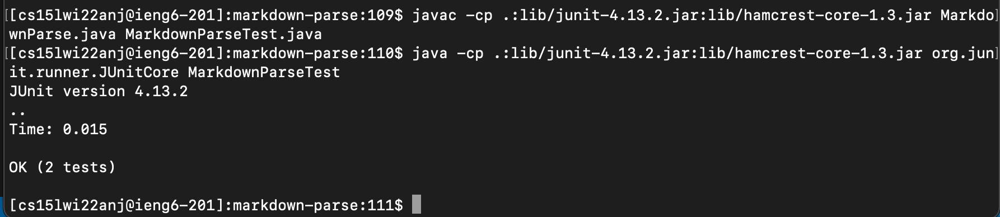
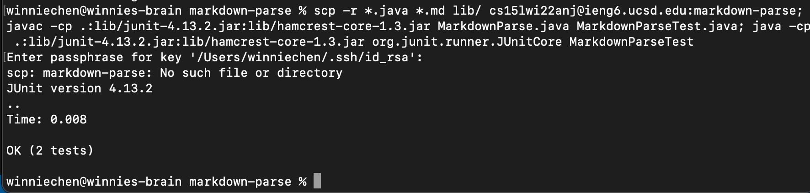

# Lab Report 3

## 1. SCP-ing markdown parse to ieng account
The way I did it, it copied all the github files over as well.



## 2. Compiling and running the test

Here is compiling it and running it in the ieng account:



## 3. Combining scp, ;, and ssh to copy the whole directory and run the tests in one line

I would do all of this in one line by using this command (this time without all the github files):

```
scp -r *.java *.md lib/ cs15lwi22anj@ieng6.ucsd.edu:markdown-parse; javac -cp .:lib/junit-4.13.2.jar:lib/hamcrest-core-1.3.jar MarkdownParse.java MarkdownParseTest.java; java -cp .:lib/junit-4.13.2.jar:lib/hamcrest-core-1.3.jar org.junit.runner.JUnitCore MarkdownParseTest
```
