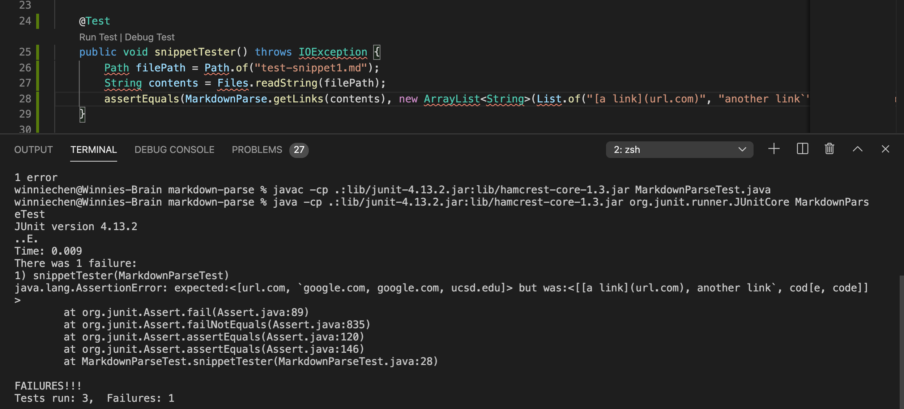
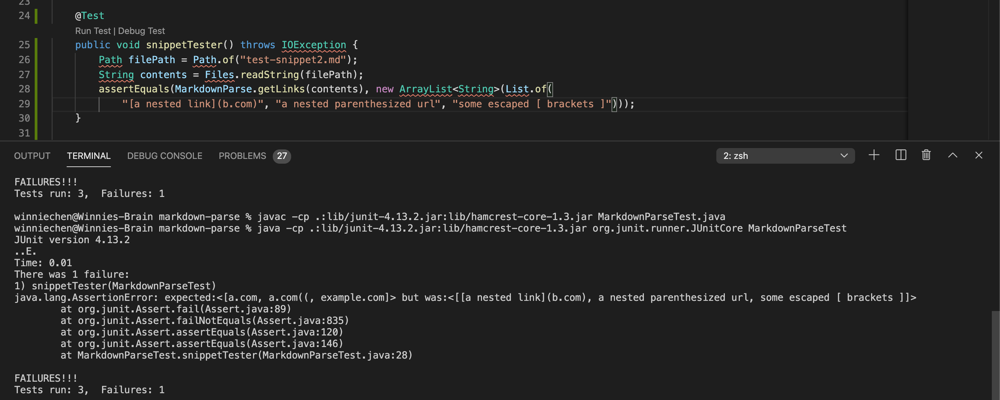
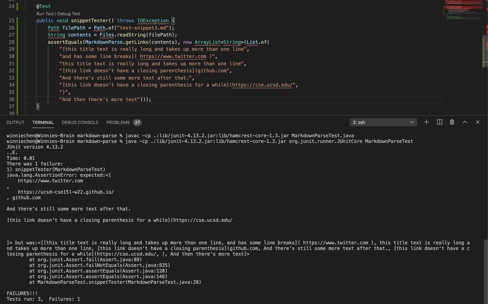
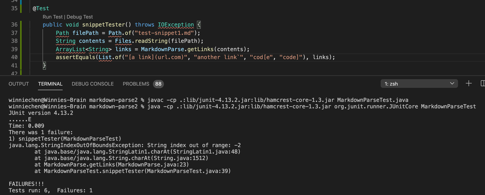
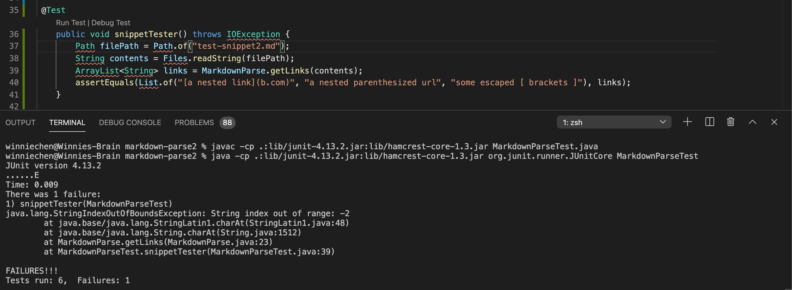
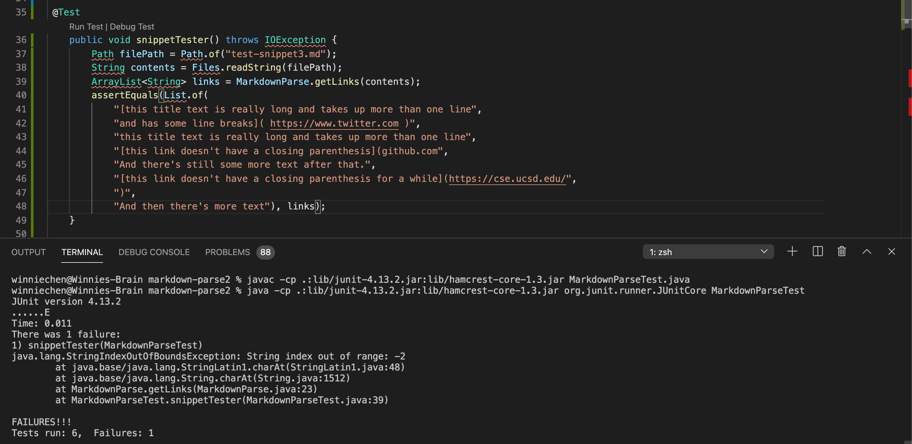

# Lab Report 4

## My Code
[Link to My Code](https://github.com/winniecibo/markdown-parse)
### Snippet 1

### Snippet 2

### Snippet 3

## Reviewed Code
[Link to Reviewed Code](https://github.com/mramada22/markdown-parse)
### Snippet 1

### Snippet 2

### Snippet 3

## Q/A

I think it would be possible for a small code change to fix it because right now it's only parsing the parts within parentheses. We could probably fix it by parsing the characters wrapped by brackets.

For snippet 2, markdown parse is doing a lot more things so I don't think it would be a code change that is <10 lines. It would have to not parse the second list of characters in the parentheses.

I don't think this would be possible to fix in <10 lines because the code would have to ignore new lines until it reaches the next bracket. It also ignores the new brackets when it doesn't have the closing brackets and just prints it out as is.