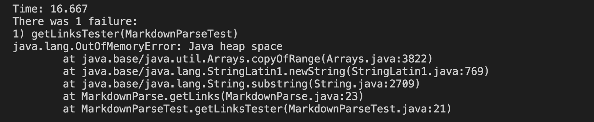
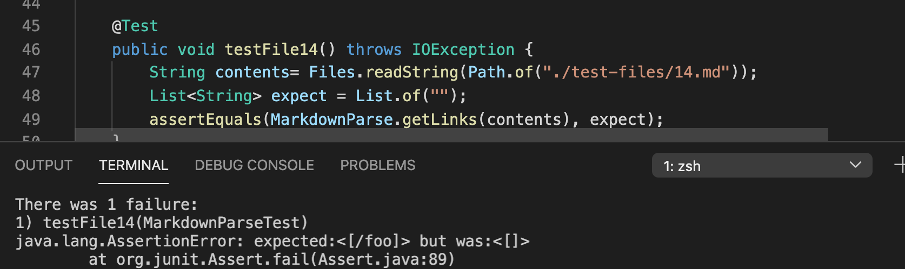

# Lab Report 4

I found the tests with different results by looking through the test files and selecting the ones I found interesting. I then tested each file with the ttwo different implementations.

## Test 1 (14.md)
My implementation could not give an output because of a memory error:


The provided implementation gave this output:
```
[/foo]
```


1. I think neither implementation is correct because there were no links in test-file 14, so it should've returned nothing. My implementation had some memory errors, and the provided implementation provided the text after the brackets inside the parentheses.

2. The provided implementation was just checking for the brackets and parentheses. To fix this, maybe we could add some code that would check if the text parsed is actually a link here:


## Test 2 (.md)
My implementation returned no links, which I think is correct:


The provided implementation returned:
```
java.util.ImmutableCollections$List12<[]>
```

which shows that the text was probably parsed incorrectly. Instead of an ArrayList, it was an ImmutableCollection(?)

2. I think the provided implementation did not have the correct parsing method for text with "<>" and that's what caused the change in return type. This could probably be fixed by adding another way that the text is parsed here:
